# 说明
基于SDXL的NB LoRA(陆续更新)

**因gitee仓库大小限制，LoRA文件上传至网盘
https://www.123pan.com/s/gkwzVv-I5Xa.html**

NB LoRA模型，供有兴趣AI生成内容的朋友使用（ **征求买老师的意见后，这里不产出买老师相关的AI内容，朋友们有什么意见和建议及时联系我，不合适的地方及时删除** ）。

训练底模使用的是[【SDXL】Anime/bulldozer_BETA](https://civitai.com/models/264323/sdxlanimebulldozerbeta?modelVersionId=298024) 所以跑图时使用此底模会得到较好的效果。

------------

### 预览图&触发词&权重推荐
下方预览图手机端可能不显示，建议在电脑查看本文档

我个人的使用过程中基本上不需要额外添加特征提示词就可以做到还原,如果有缺失或多余特征建议通过正/反prompt进行微调。

#### kino
*推荐权重0.8左右*
```
触发词: kino
可能会用到的补充正反向prompt: hair ribbon
```
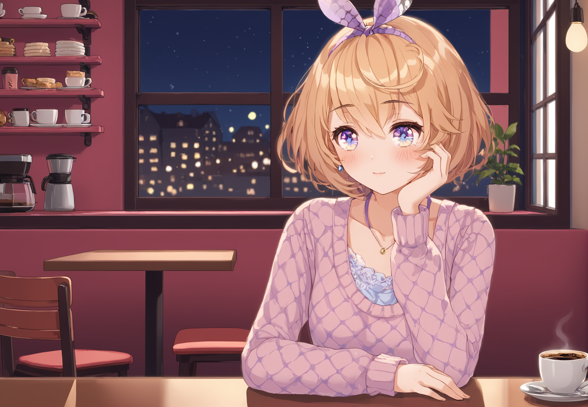
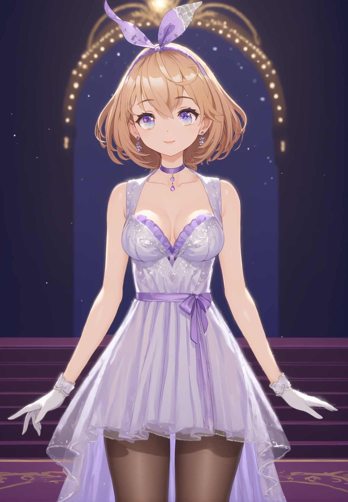


#### jiuxia
*推荐权重0.75左右*
```
触发词: jiuxia  
可能会用到的补充正反向prompt: double bun
```
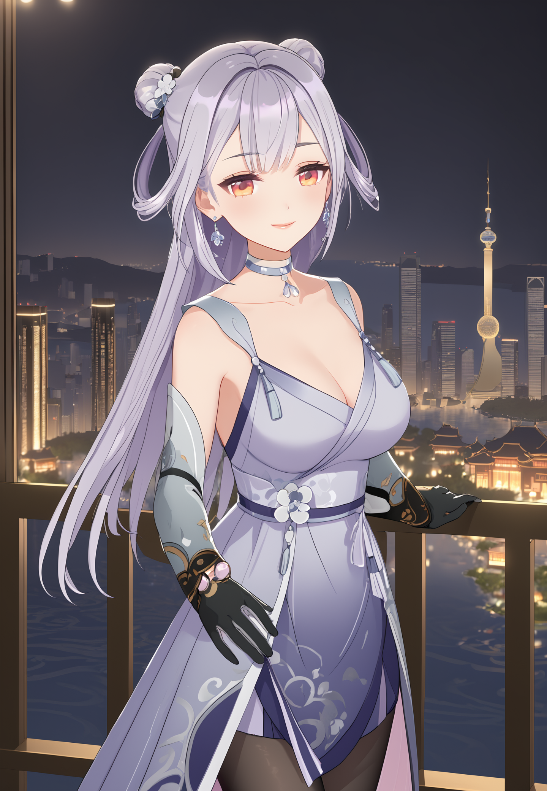
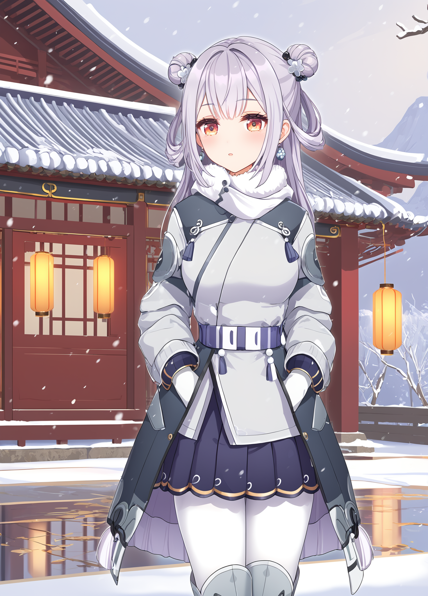


#### 鸭鸭
*推荐权重0.8左右*
```
触发词: katya
可能会用到的补充正反向prompt: hair ornament
```
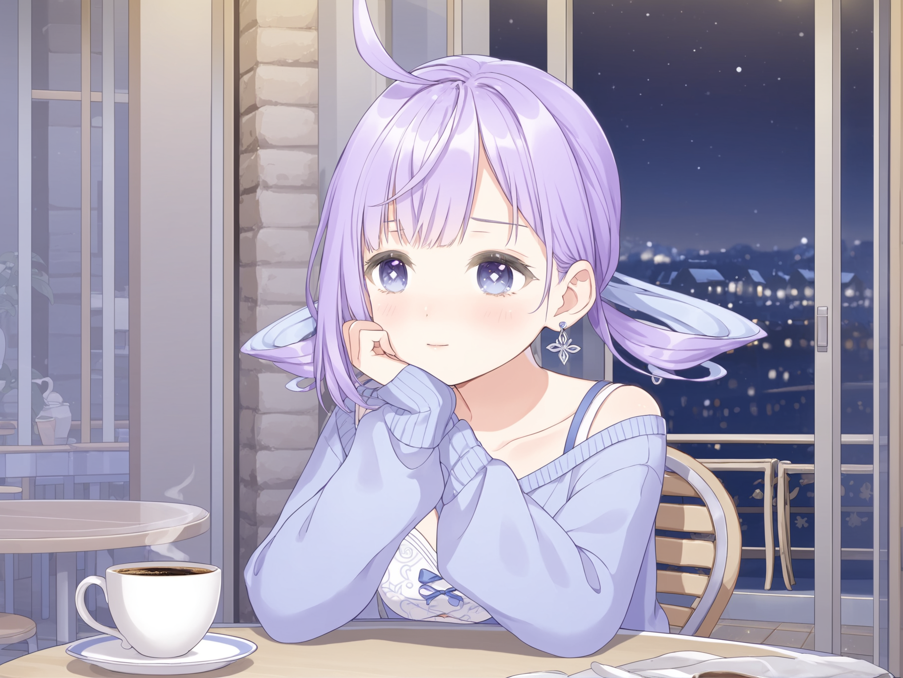
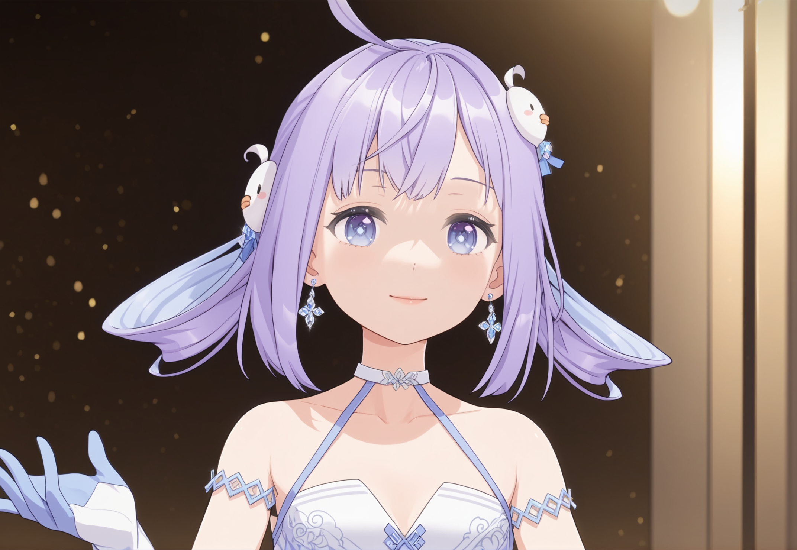

#### 叶子
*推荐权重0.75左右*
```
触发词: yezi 
可能会用到的补充正反向prompt: mole under eye
```
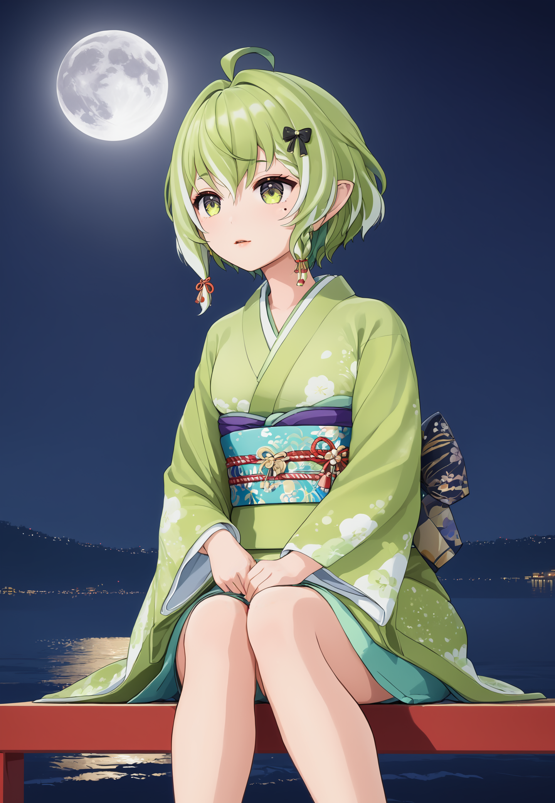
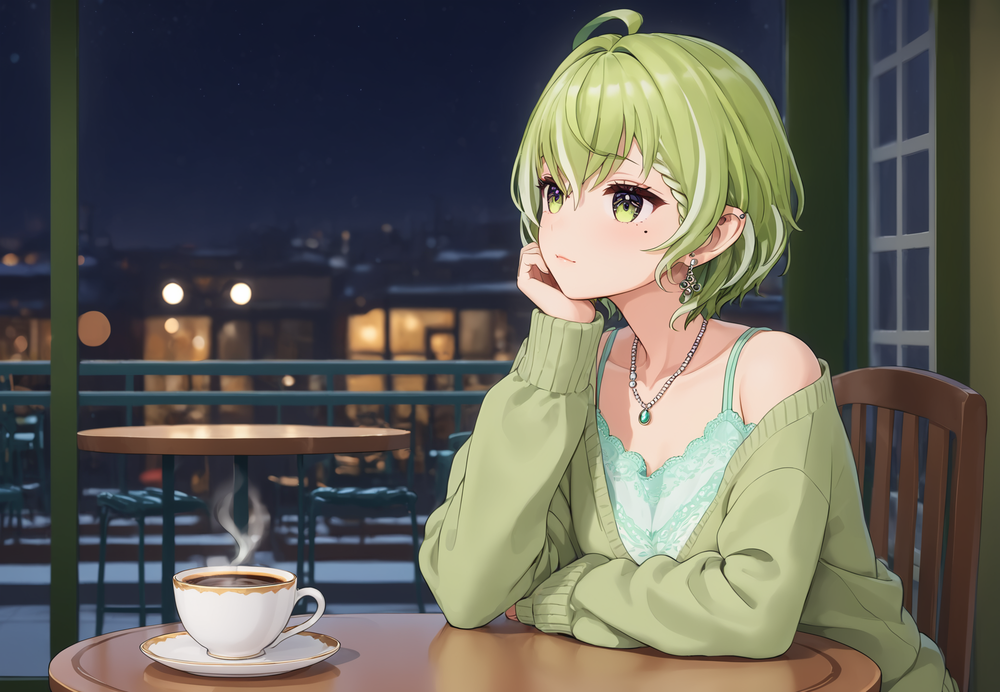

#### 纸哥
*推荐权重0.8左右*
```
触发词: xuanxiaozhi
可能会用到的补充正反向prompt: twin braids, hair flower
```
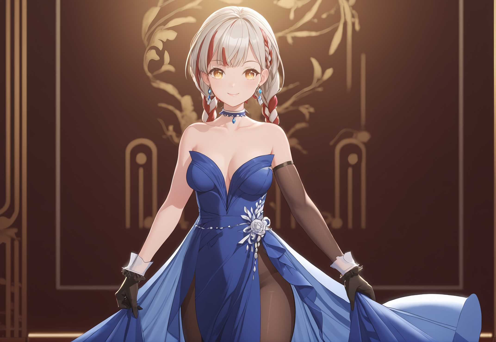
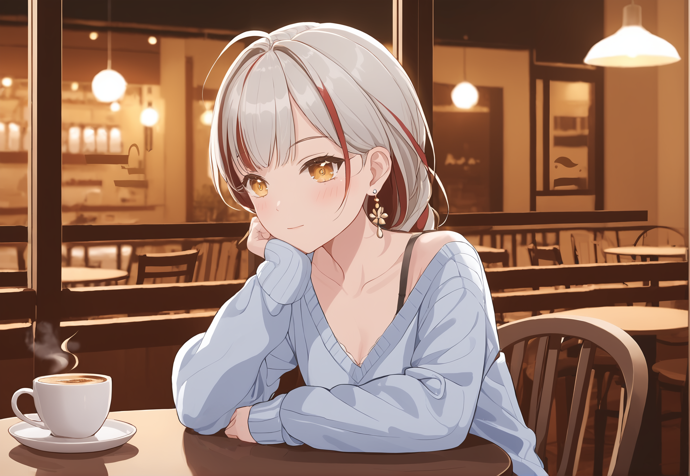


#### 娜娜
*推荐权重0.8左右*
```
触发词: nana
可能会用到的补充正反向prompt: twin braids, hair flower
```

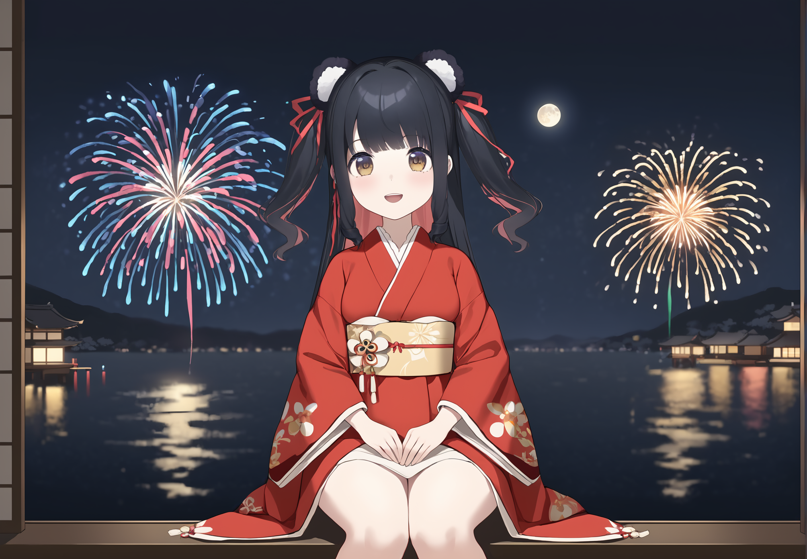
